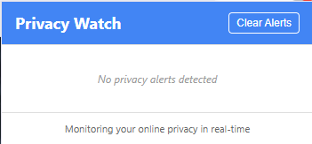
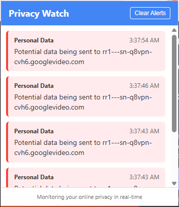

# 🔒 PrivacyWatch

**PrivacyWatch** is a powerful browser extension that actively monitors websites in real-time to detect personal data collection, usage, and third-party sharing. Our goal is to empower users by making online privacy transparent, actionable, and easy to understand.

## 🚀 Features

- 🔍 **Real-Time Tracking Detection**  
  Detects when websites attempt to access or collect sensitive data such as:
  - Email addresses
  - Phone numbers
  - Location
  - Device identifiers
  - Cookies and session IDs

- 🛰️ **Third-Party Sharing Alerts**  
  Identifies third-party scripts and trackers that may be receiving your personal information.

- ⚠️ **Instant Privacy Alerts**  
  Get clear, real-time notifications when data collection or sharing is detected.

- 🛡️ **User Privacy Dashboard**  
  View and manage what data has been flagged, which sites were involved, and what third parties are collecting it.


## 📸 Screenshots

> Add screenshots to demonstrate the extension's interface and features.

| Popup Interface | Real-time Alerts |
|-----------------|------------------|
|  |  | 


## 📦 Installation

### For Chrome (Developer Mode)

1. Clone this repository:
   ```bash
   git clone https://github.com/NoobCoder143/PrivacyWatch-Extension.git
   ```
2. Go to `chrome://extensions/`
3. Enable **Developer Mode** (top right).
4. Click **"Load unpacked"** and select the `/PrivacyWatch-Extension` directory.


## 🛠️ Tech Stack

- **JavaScript** – Core logic and browser API interactions  
- **Manifest v3** – Extension manifest format for Chrome compatibility  
- **WebExtensions API** – Cross-browser support  
- **Content Scripts & Background Service Workers** – For monitoring and notifications  

## 📁 Project Structure

```
privacywatch/
├── background.js         # Background logic for request interception
├── contentScript.js      # Runs in web pages, detects data access
├── popup.html            # Extension popup UI
├── popup.js              # Script for popup interactions
├── styles.css            # Popup styling
├── icons/                # Extension icons
├── screenshots/          # Screenshots used in README
└── manifest.json         # Extension metadata and permissions
```

## 🧠 How It Works

PrivacyWatch leverages `webRequest` APIs and DOM scanning to identify common privacy violations:
- **Request interception** is used to monitor and analyze outgoing requests.
- **Content scripts** scan web pages for patterns indicating personal data access.
- Detected patterns trigger **browser notifications** and log entries in the dashboard.

## ✅ Permissions Used

- `webRequest`, `webRequestBlocking` – to monitor network requests.
- `tabs`, `activeTab` – to access tab content for analysis.
- `storage` – to save user preferences and logs locally.
- `notifications` – to alert users in real time.


## 🙌 Contributing

Pull requests are welcome! For major changes, please open an issue first to discuss what you'd like to change.

1. Fork the project
2. Create your feature branch (`git checkout -b feature/AmazingFeature`)
3. Commit your changes (`git commit -m 'Add some AmazingFeature'`)
4. Push to the branch (`git push origin feature/AmazingFeature`)
5. Open a Pull Request


> Stay informed. Stay safe. Browse privately with **PrivacyWatch**.
